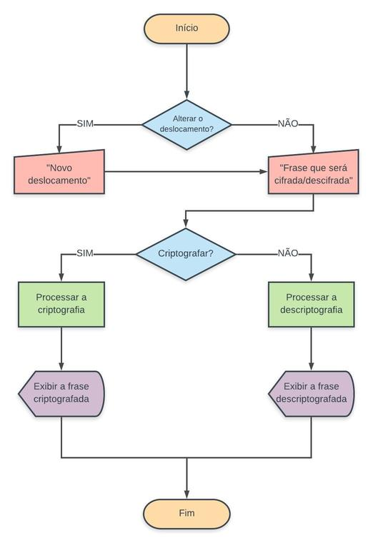

# Cifra de César

## Prefácio

Maria frequentemente esquece suas senhas, pensando nisso decidiu anotá-las, 
mas lembrou que outras pessoas podem ter acesso, então pensou em criptografar
antes de anotá-las, assim poderá guardá-las criptografadas e com segurança, 
sem que possam descobrir e quando precisar utilizá-las poderá descriptografar. 😎

## Introdução

A [cifra de César](https://pt.wikipedia.org/wiki/Cifra_de_C%C3%A9sar) é um dos
primeiros tipos de criptografias conhecidos na história. É um tipo de cifra por
substituição, em que uma letra no texto original é substituída por outra,
seguindo um número fixo para essa subtituição.

O imperador Júlio César usou essa cifra para enviar ordens aos seus generais no
campo de batalha. Essa é uma das técnicas mais simples e mais usadas para
cifrar mensagens.

Por exemplo se usarmos o deslocamento de 3:

* Alfabeto sem cifrar: A B C D E F G H I J K L M N O P Q R S T U V W X Y Z
* Alfabeto com cifra:  D E F G H I J K L M N O P Q R S T U V W X Y Z A B C

## Checklist
### Parte Obrigatória

* [ ] `README.md` com explicações e desenho do projeto: No `README.md` descreva o seu processo de desenvolvimento utilizando os diagramas de bloco e como definiu os usuários quando estava desenvolvendo
seu projeto.
* [ ] Usar VanillaJS.
* [ ] Permitir escrever um texto, com letras maiúsculas e minúsculas, para ser
  cifrado.
* [ ] Mostrar o resultado da cifra corretamente.
* [ ] Permitir escrever um texto, com letras maiúsculas e minúsculas, para ser
  descifrado.
* [ ] Mostrar o resultado descifrado corretamente.
* [ ] Permitir escolher o `offset` (_deslocamento_) a ser usado na cifragem/descifragem.
* [ ] Implementa `cipher.encode`.
* [ ] Implementa `cipher.decode`.
* [ ] Criar testes unitários.

## Fluxograma

### Scripts / Arquivos

* `src/index.html`: este é o ponto de entrada da aplicação. Este arquivo
  contem o _markup_ (HTML) e o CSS e JavaScript necessário.
* `src/cipher.js`: este é o objeto (`cipher`) contem dois métodos:
    - `cipher.cifrar(string,offset)`: `string` a mensagem (texto) que queremos 
    cifrar e `offset` é o número de posições que queremos mover para a direita 
    no alfabeto.
    - `cipher.decifrar(string,offset)`: `string` é a mensagem (texto) que queremos 
    decifrar e `offset` é o número de posições que queremos mover para a esquerda 
    no alfabeto.
* `src/tests.js`: este arquivo que contem os testes.